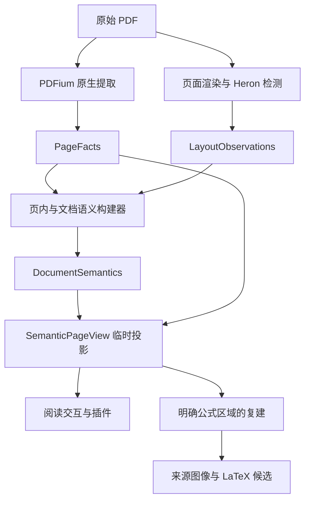

# 文档分析与数据契约

[文档目录](README.md) · 相关：[架构](architecture.md)、[插件读取指南](extension-api/documents-and-reader.md)

本体同时保存“PDF 提供了什么”和“这些内容在文档中意味着什么”。来源事实不会因标题、段落或公式推断改变；文档语义是唯一的结构解释。OCR 和译文另行表示。

## 从 PDF 到语义

当前是 Heron 模型加 TypeScript 构建器，不是完整 Python Docling 管线。PDF.js 用于显示，PDFium 用于来源提取/渲染与裁剪。没有同时保存另一份混合 PageAnalysis。

## 三类持久输入与解释

| 对象               | 内容                                                       | 边界                                 |
| ------------------ | ---------------------------------------------------------- | ------------------------------------ |
| PageFacts          | 页面尺寸、字符、字形属性、绘图对象、坐标、警告、提取身份   | 不包含段落、阅读顺序、标题层级或 OCR |
| LayoutObservations | 原始检测类别、Box、confidence、模型与观测身份              | 是预测，不是接受后的段落/图注归属    |
| DocumentSemantics  | 节点、内容片段、章节、公式归属、关系、阅读顺序、来源和证据 | 不保存 LaTeX/OCR 候选或译文          |

PageFacts 与 LayoutObservations 都是 source/schema/cacheKey 有版本的数据。原始预测单独表示，语义构建器可以改变去重、归属或标题规则而复用兼容输入。

SemanticPageView 是临时页面投影，包含 facts、document、stage、blocks、formulas、readingOrder、plainText 和 warnings。它不作为另一个权威页面树持久化。`stage: native` 表示没有本页布局观测的回退投影；完整段落框选需要 layout 阶段。

## 来源与坐标

类型在 [analysis.ts](../src/domain/analysis.ts)、[document-semantics.ts](../src/domain/document-semantics.ts)和[reader.ts](../src/domain/reader.ts)。

| 约定          | 含义                                                                    |
| ------------- | ----------------------------------------------------------------------- |
| documentId    | 原始 PDF 内容 SHA-256，不是路径或标题                                   |
| page          | 1 起始页码                                                              |
| Box           | 显示页面 `[left, top, right, bottom]`，归一化，含固有页面旋转，不含缩放 |
| 字符/对象索引 | 对应页内的具体提取，不跨页或跨 factsKey 通用                            |
| SourceRef     | documentId、page、factsKey、Box、characterIndices、objectIds            |
| 语义节点 ID   | 来源与语义版本内的身份，不承诺跨版本永久稳定                            |

一个节点可以有多个来源片段。不能用某个 UI canvas 的像素框直接查询另一解析版本；也不能依据视觉顺序假定所有 character.index 都连续。

ReaderSelection 用 x/y/width/height 表示归一化范围，而 Box 用左右上下端点。两者转换是显式的，来源截图只是预览，不能替代精确字符与事实版本。

## 语义结构参考

| 字段 / 类型                     | 用途                                                                       |
| ------------------------------- | -------------------------------------------------------------------------- |
| `nodes: SemanticNode[]`         | kind、text、sources、content、evidence，可附 headingLevel、role、sectionId |
| `content: ContentSpan[]`        | 文字片段与公式引用，文字附 sourceIndex 与字符索引                          |
| `formulas: SemanticFormula[]`   | inline/display、块归属、来源、baseline/emSize 与证据                       |
| `readingOrder: string[]`        | 当前结构中节点阅读顺序                                                     |
| `sections: DocumentSection[]`   | headingId、level、parentId、nodeIds，inferred/provisional 状态             |
| `relations: SemanticRelation[]` | caption-of、panel-of、continues；inferred/candidate 与证据                 |
| `inputs`                        | 每页 factsKey、可选 observationKey 和 warnings                             |
| `coverage`                      | factsPages、layoutPages、missingPages、complete                            |
| `cacheKey/revision`             | 构建契约身份与当前替换式快照代次                                           |

SemanticEvidence 保存 rule、confidence 与可选 observationKey。confidence 是具体模型或规则证据，不是整篇论文解释正确的概率。

## 推断范围与不确定性

标题层级使用全文已知标题编号和同页重叠证据，章节在全文覆盖不足时可以是 provisional。缺失布局页会打断章节传播与跨页连续性，不把远处已知章节强行套到缺页之后。

摘要以显式 Abstract/摘要标签作为证据，不确定时不生成角色。图注和子图归属由页面关系规则推断，保留证据。相邻页未结束段落可以产生 continues **候选**，当前不会自动把两段合并；候选不等于确定关系。

全文 readingOrder、节点 kind 或章节都可能误判。消费方应区分原始观测与语义解释，保留来源核对与候选状态，不能把所有 relations 当作同等可靠事实。

## 部分覆盖与生命周期

当前页优先提取，其他页面逐步补齐。每个新页面产生替换式 DocumentSemantics 快照，revision 变化；旧对象不会被就地改成新结构。

消费者读取当前快照并监听变化，按 documentId/revision 检查迟到结果。complete=false 仍可能有多个已完成页；查看 coverage 与页面 stage 决定当前功能可否进行。翻译把输出来源和背景都绑定同一快照，背景不扩张输出范围。

关闭文档释放分析 Worker，重新打开时验证缓存身份与来源引用，复用兼容缓存并补齐缺页/缺失阶段。插件停用不结束共享分析；本体切换或关闭文档则是另一生命周期。

## 版本与缓存变更

配置权威为 [domain/model.ts](../src/domain/model.ts)：

| 改动                               | 应检查 / 更新                               |
| ---------------------------------- | ------------------------------------------- |
| PDFium 提取、字符指标或坐标契约    | PAGE_FACTS_KEY 与来源校验                   |
| 模型权重、阈值、页面渲染/观测契约  | LAYOUT_OBSERVATIONS_KEY                     |
| 段落组装、标题、公式归属或关系规则 | DOCUMENT_SEMANTICS_KEY                      |
| OCR 提示、候选规范化与校验         | 对应 OCR cachePrefix / 候选版本，不改原事实 |
| 纯目录移动或 UI 样式               | 不因此改变分析身份                          |

旧混合缓存只迁移已确认兼容的原生来源；不能从旧组装块反推“原始模型观测”。改变版本时同步校验、迁移与相应夹具，详见[测试维护](../tests/README.md)。

## 关键实现入口

- [session.ts](../src/application/document-analysis/session.ts)：会话、阶段、覆盖与恢复。
- [page-semantics.ts](../src/application/document-analysis/page-semantics.ts)：页内组装与关系。
- [document-semantics.ts](../src/application/document-analysis/document-semantics.ts)：全文标题、章节、快照与投影。
- [formulas.ts](../src/application/document-analysis/formulas.ts)：公式定位及原生候选。
- [analysis/protocol.ts](../src/infrastructure/analysis/protocol.ts)：Worker 的 open/extract/detect/export 请求。
- [缓存说明](user-guide/data-and-cache.md)：用户可见清除范围与恢复。

扫描件全文 OCR、TableFormer 与整篇译文 PDF 重排尚未实现；数据契约为后续功能提供基础，不意味着这些输出现在可用。
