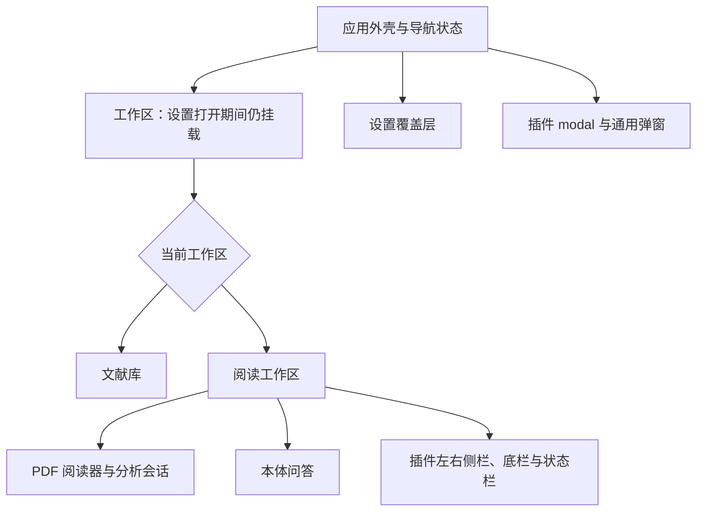

# 前端重构交接

[文档目录](README.md) · 配套：[验收清单](frontend-acceptance.md)、[样式](styles.md)、[多语言](i18n.md)

本页给负责 UI 重构的人使用，对应当前 Cachalot 0.1.0。目标是重新组织界面与视觉，同时保留阅读、文献管理、本体问答、模型/OCR、缓存与插件工作台的功能。组件名称和当前视觉不是必须沿用的架构；本体能力与插件边界、数据身份和已确认的阅读交互才是交接契约。

## 接手后的第一轮操作

1. 按[快速开始](get-started.md)启动应用；推荐 Node 24.x。浏览器预览适合开发 UI，桌面网络和存储由 Tauri 适配。
2. 在独立浏览器 profile 或隔离测试环境导入 PDF，体验文献库、连续阅读、框选、文字选择和设置覆盖层。
3. 阅读下方组件与服务地图，重点查看 App 的工作区挂载、useDocumentAnalysis 的会话绑定以及 ExtensionWorkbench 的动态视图。
4. 运行现有相关用例，保留改动前的结果。没有论文或服务商时先用自带合成 PDF、模拟模型的浏览器用例；不为原型调用真实收费服务。
5. 按[验收清单](frontend-acceptance.md)安排实现顺序与回归，交付时提供两种横屏尺寸、中英文和关键失败状态的结果。

本体是理解版面的学术 PDF 阅读器，问答栏属于本体。选区翻译是预装、可停用、不可卸载的插件。新界面要容纳以后未知的插件，不能只为这一个翻译功能设计固定入口。

## 可调整的部分与保留的契约

| 可调整                                         | 保留的契约                                                                |
| ---------------------------------------------- | ------------------------------------------------------------------------- |
| 字体、配色、图标、控件外观、间距与布局组织     | 中英文完整、可访问操作、横屏阅读；蓝色手势框与紫色翻译命中框含义清楚      |
| App 拆分、组件目录、hooks/视图模型与 UI 控件库 | 本体 UI 通过应用服务与领域 DTO 工作；插件通过 SDK；基础设施不反向依赖界面 |
| 设置入口、导航外观、菜单/弹窗实现              | 设置打开期间保留阅读与聊天工作区；存储失败有反馈，表单草稿与密钥显示分开  |
| 插件标签、面板外壳与尺寸控制                   | 动态贡献、五种视图位置、关闭/重新展开/移动/尺寸偏好与视图取消             |
| PDF 周围的工具栏和页面装饰                     | 原 PDF 显示、连续滚动、来源坐标、精确选取、按需渲染与分析生命周期         |
| 翻译结果的视觉与控件                           | 横屏三栏核对、同一公式候选、来源图片、阶段/错误反馈和通过校验后的复制     |

当前代码中的像素尺寸、Tailwind 类名和大组件可重组。更换 UI 控件库时验证 portal、focus、pointer capture 和卸载行为，避免外观相同却改变操作。仅改视觉不需要改变提取、模型、语义或 OCR 缓存版本。

## 界面与组件地图

以下是源码入口，不要求新版本保留相同组件树。

| 区域                | 当前入口                                                                                                                                                                     | 接手时关注                                                        |
| ------------------- | ---------------------------------------------------------------------------------------------------------------------------------------------------------------------------- | ----------------------------------------------------------------- |
| 应用外壳与导航      | [App.tsx](../src/App.tsx)、[AppSidebar](../src/components/workspace/AppSidebar.tsx)、[AppNotice](../src/components/workspace/AppNotice.tsx)                                  | 导航、活动文献身份、设置覆盖与全局提示                            |
| 文献库页面与状态    | [LibraryPage](../src/components/library/LibraryPage.tsx)、[useLibrary](../src/hooks/useLibrary.ts)                                                                           | 页面布局与数据操作分开；导入、筛选、分类、排序和进度              |
| 阅读工作台          | [ReaderWorkspace](../src/components/workspace/ReaderWorkspace.tsx)                                                                                                           | PDF、本体聊天和插件 docks 的共同生命周期                          |
| 模型选择与宿主桥    | [useChatModel](../src/hooks/useChatModel.ts)、[useWorkspaceExtensions](../src/hooks/useWorkspaceExtensions.ts)                                                               | 已添加模型恢复、图像能力、模型与选区订阅                          |
| 文献卡片与首页预览  | [LibraryDocumentCard](../src/components/LibraryDocumentCard.tsx)、[DocumentPreview](../src/components/DocumentPreview.tsx)                                                   | 收藏、移动、删除、异步预览、长标题与稳定文献身份                  |
| 分类与排序          | [CategorySidebar](../src/components/CategorySidebar.tsx)、[CategoryDialogs](../src/components/CategoryDialogs.tsx)、[LibrarySortMenu](../src/components/LibrarySortMenu.tsx) | 普通分类与收藏独立，删除分类保留论文，四种排序与偏好              |
| 阅读外壳与导航      | [PdfReader](../src/components/PdfReader.tsx)                                                                                                                                 | 原生目录、缩略图、页码、缩放、工具、滚动位置与共享分析            |
| 单页显示与交互      | [PdfPageView](../src/components/pdf/PdfPageView.tsx)、[page-layout](../src/components/pdf/page-layout.ts)                                                                    | canvas/文字层、可见区域渲染、几何、手势、覆盖框与异步代次         |
| 分析与 React 的桥接 | [useDocumentAnalysis](../src/hooks/useDocumentAnalysis.ts)                                                                                                                   | 创建/释放会话、绑定插件文档读取、发布语义与恢复缓存               |
| 本体问答与输入      | [ChatPanel](../src/components/ChatPanel.tsx)、[ChatComposer](../src/components/ChatComposer.tsx)、[ModelPicker](../src/components/ModelPicker.tsx)                           | 会话、流式内容、附件适配器、图像能力与草稿                        |
| 设置外壳            | [ProviderSettings](../src/components/ProviderSettings.tsx)                                                                                                                   | 实际承载通用、模型、OCR、缓存、插件及插件设置；名字不只代表模型页 |
| 服务商与密钥        | [ProviderEditor](../src/components/ProviderEditor.tsx)、[ApiKeyField](../src/components/ApiKeyField.tsx)                                                                     | 未保存草稿、临时模型目录、接口地址与真实密钥读取                  |
| OCR 与缓存          | [OcrSettings](../src/components/OcrSettings.tsx)、[CacheSettings](../src/components/CacheSettings.tsx)                                                                       | 独立选择、连接检查、六类缓存、确认与统计错误                      |
| 通用插件工作台      | [ExtensionWorkbench](../src/components/extensions/ExtensionWorkbench.tsx)、[ExtensionSettings](../src/components/extensions/ExtensionSettings.tsx)                           | 外部订阅、动态登记、树/Webview、视图实例、安装与依赖预览          |
| 选区翻译插件 UI     | [TranslationPopup](../src/extensions/selection-translation/TranslationPopup.tsx)、[TranslationSettings](../src/extensions/selection-translation/TranslationSettings.tsx)     | 结果与提示词属于插件；经 SDK 挂载，不在 App 中直接导入            |
| 共享显示与基础控件  | [MathMarkdown](../src/sdk/MathMarkdown.tsx)、[Modal](../src/components/ui/Modal.tsx)、[ActionMenu](../src/components/ui/ActionMenu.tsx)                                      | 数学/图片回退、原生 dialog、菜单 portal 与键盘行为                |

样式主题在 [app.css](../src/styles/app.css)，控件组合在 [sdk/ui/styles.ts](../src/sdk/ui/styles.ts)，PDF.js 文字层兼容规则在 [pdf-text-layer.css](../src/styles/pdf-text-layer.css)。当前 AppSidebar 使用的品牌图为 [cachalot-icon.png](../assets/brand/cachalot-icon.png)；其他品牌与背景资源放在 assets 下，不都已经用于界面。

## 工作区挂载与状态归属

| 状态                                         | 当前拥有者                               | 持续时间与重构约定                                                            |
| -------------------------------------------- | ---------------------------------------- | ----------------------------------------------------------------------------- |
| 活动论文、页码、导航与面板开关               | App                                      | 文献 ID 是阅读工作区身份；设置打开时保留工作区                                |
| 文献列表、分类、筛选、排序与导入状态         | useLibrary + 应用设置服务                | 页面展示状态与已保存偏好分开；读写通过 services                               |
| 服务商、当前模型与图像能力                   | useChatModel + 应用设置服务              | 只选已添加聊天模型；能力按当前模型读取                                        |
| 模型/活动文档同步与选区/错误订阅             | useWorkspaceExtensions                   | 保持宿主订阅，卸载时释放；不负责插件业务                                      |
| PDF.js 文档、bytes、缩放、导航目标与工具模式 | PdfReader                                | 同一论文阅读期间复用；设置和插件安装不重建                                    |
| 事实/语义快照、分析进度与 session            | useDocumentAnalysis + 应用会话           | 按 documentId/bytes 建立，页面和 revision 更新不重新创建模型/Worker           |
| 当前选区及归属                               | 阅读器产生，extensionHost 发布，App 订阅 | 选区来源与工具作用域一致；插件释放时清理自己的选区                            |
| 会话、消息、输入草稿与附件适配器             | ChatPanel / assistant-ui runtime         | 设置覆盖、UI 语言和选择模型不重新创建输入 runtime；请求中操作遵循已有禁用规则 |
| 模型表单草稿                                 | ProviderEditor                           | 模型服务编辑器在同一次设置窗口的栏目切换中隐藏而非卸载                        |
| 插件设置草稿、结果与请求                     | 注册视图实例 / 插件作用域                | 由实例 signal 及插件 signal 管理；关闭、替换、停用有明确清理                  |
| 视图位置、关闭状态和尺寸                     | 插件宿主与工作台设置                     | 不用一套只认识翻译插件的本地状态覆盖宿主目录                                  |

App 负责组合页面和导航，LibraryPage/AppSidebar/ReaderWorkspace 负责对应布局；useLibrary/useChatModel 保留状态在应用外壳的整个生命周期中，切换页面不重新加载它们。模型/文献状态通过 useWorkspaceExtensions 同步到宿主。

设置覆盖层目前使用保留挂载的工作区，并设 invisible、inert 与 aria-hidden。替换实现时继续屏蔽底下交互及键盘焦点；不要把 workspace 从条件渲染树中删除。路由/布局重构可改变实现方式，但应保持 PDF 节点、分析会话和等待中的本体聊天。

阅读器与聊天当前按文献 ID 区分实例；不要用 page、语言、所选模型或 semantics.revision 作为整棵工作区的 key。翻译插件结果会在模型变化时取消旧请求并按新模型重新发起，这是插件自己的行为，不能由本体工作区 key 来实现。

ProviderSettings 保留的是模型服务编辑器和已注册插件设置视图，并非所有分支：OCR、缓存和插件安装页目前按栏目挂载。离开整个设置页会卸载设置内容；不要把“切换栏目保留草稿”写成已具备跨关闭恢复的能力。

## 本体 UI 如何接服务

权威入口为 [application/services.ts](../src/application/services.ts)，详细类型见源码。表中名称用于找到已有契约，不是需要再建一层 HTTP API。

| 用户操作                   | 接口                                                                                       |
| -------------------------- | ------------------------------------------------------------------------------------------ |
| 文献 CRUD、文件与进度      | services.library 的 list/importPaper/loadPdf/preview/setProgress/setStarred/move/remove    |
| 分类                       | services.categories 的 list/create/remove                                                  |
| 模型配置、目录、密钥与能力 | services.providers 的 list/save/remove/listModels/supportsImages/keyPreview/revealKey/test |
| OCR 选择与预设             | services.ocr 的 getSelection/select/adapters/presets/endpoint/createPreset/test            |
| 偏好                       | services.settings.get/set                                                                  |
| 缓存统计与分类清除         | services.cache.usage/clear                                                                 |
| 历史会话与消息             | services.conversations 的 create/list/rename/remove/messages/saveMessage/removeMessage     |
| 本体问答                   | services.assistant.askPaper，增量回调和最终字符串                                          |
| 共享分析                   | services.analysis.createSession，React 可复用 useDocumentAnalysis                          |
| 插件注册与宿主事件         | application/extensions/runtime 和工作台的 useExtensions                                    |

本体 UI 不自行请求模型、读写 IndexedDB/SQLite、读取 keyring 或调用 Tauri 命令。PDF.js 的显示、文字层和缩略图属于阅读 UI 的本地渲染职责。组件可以拆出 hooks/视图模型，仍通过以上服务处理副作用。

领域 DTO 见 [records.ts](../src/domain/records.ts)、[reader.ts](../src/domain/reader.ts)与[文档数据契约](document-analysis.md)：

- DocumentRecord.id 是 PDF 内容 SHA-256；创建/更新时间为 Unix 秒，ChatMessage.createdAt 为毫秒。显示日期时正确换算并使用当前 locale。
- ReaderSelection 的 x/y/width/height 与 Box 的四个端点都是归一化页内坐标，页码从 1 开始。截图不替代字符索引和来源版本。
- PageFacts/原始观测与 DocumentSemantics 不互相改写。UI 可以展示推断、部分覆盖与错误，不能在组件里维护另一份权威页面树。
- Provider 是模型元数据与 hasKey，ProviderInput.apiKey 是实际替换草稿。遮罩、显示过的已存密钥、占位词均不能自动写成新密钥。

异步回调检查所属文献、视图/请求代次与取消状态。可取消的插件请求用 signal；分析是共享本体任务，停用一个插件不取消全文分析。服务错误通过消息编码与 localizeMessage 呈现，第三方正文按脱敏普通文字保留，不能作为 HTML 渲染。

## PDF 与翻译交互的保留点

1. 页面纵向连续排列；滚动更新当前页，不能把每个 wheel 事件改成整页跳转。重开恢复页码，目前不持久保存页内偏移。
2. 缩放和显式跳页使用同一页面几何；被动当前页更新不再次滚回页首。混合页尺寸、固有旋转、短末页与文档底部均需验证。
3. 高清画布与文字层只在视口附近渲染，远页保留尺寸占位。不能为外观重构改成所有页同时高清渲染，也不能为每页建立分析会话。
4. PAGE_GAP/PAGE_PADDING 与页面实际 CSS 间距一致；目前是 gap-6/py-7 对应 24/28 像素。若改间距，同步 page-layout 的几何和导航测试。canvas 像素尺寸与显示尺寸、设备像素比各自处理。
5. 蓝色无填充框是本体手势；紫色边框与半透明填充是翻译插件接受的完整单元。部分段落/行间公式不命中，行内公式随完整段落，未命中时没有翻译动作。
6. 文字模式按原生字符精确选择，不自动补全。原生复制可跨页，翻译目前限单页；不要静默合并不同页来源。
7. 阅读器做异步 preview/select/when 与悬停的代次/信号控制。新拖动、缩放、模式变化与插件释放后，旧结果不能覆盖当前选区。
8. 用户未主动选模式时可跟随首个工具；用户已经选择文字模式后，延迟激活的插件不能抢回框选。
9. 翻译保持原 PDF、复建原文、译文三栏；原文与译文共用公式候选。失败/部分公式保留来源图片，行内图片按基线与有效字号排布；标题保持 h1–h6 语义。
10. preparing、translating、OCR 问题和失败可分别显示。流式预览不代表最终结构已校验；复制只在最终通过公式/标题协议校验后开放。重试先取消旧任务，关闭结果窗口取消其任务。

具体选取与翻译规则属于 src/extensions/selection-translation，不搬进 PdfReader。插件能被停用，阅读器不能假设始终存在翻译按钮。

## 模型、问答与设置的保留点

- 模型菜单展示已添加的模型；获取远端目录只是临时候选。聊天与 OCR 按用途筛选共享配置，不把独立 OCR 选择写成聊天选择。
- 图像能力按具体 providerId/modelId 查询，不按模型名字或提供商推断。已有消息图片继续保存；文字模型请求省略历史图像；含图草稿改选文字模型时保留草稿并阻止发送。
- 问答输入保持上传、向上展开的模型菜单、发送的已确认交互。长模型 ID 截断或合理换行，菜单/能力提示不被滚动区域裁切。
- 密钥初始仅显示遮罩，明确点显示才读取完整值；输入新值才替换，留空保存保留原值。保存、切换服务商与离开设置恢复隐藏；迟到的读取不能显示其他服务商密钥。
- 目录/测试/保存是不同状态；失败正文、request ID、表单草稿和重试范围保留。不能把失败绘成成功，不能仅替换提示词就宣称支持新的服务商协议。
- OCR 关闭、当前图像模型、独立模型是三种选择；显式独立模型失效不静默换收费服务。公式识别失败不阻止用户核对来源原图。
- 六类缓存只清除可再生数据；确认显示类别与范围，清除后刷新统计。清缓存不意味着立即卸载当前 canvas 或分析会话，不能等同清除整个站点。

当前本体 askPaper 没有取消参数，ChatPanel 也没有统一的底层请求取消控制。关闭聊天或切换论文的 UI 卸载不能视为 HTTP 已中止；若新设计加入“停止回答”，需要扩展应用服务与平台契约并验证实际取消。插件 LLM/OCR 的 signal 机制与此不同。

## 动态插件工作台

保留 sidebar.left、sidebar.right、panel、settings、modal 以及独立 statusbar。不同插件可以同时注册工具、动作、命令、视图、背景与覆盖框；工作台呈现宿主快照，不按插件 ID 写固定导航或把翻译直接当本体分支。

useExtensions 通过 useSyncExternalStore 订阅宿主。本体外壳启动宿主、同步活动文档与模型、订阅选区/错误；分析 hook 绑定 session 并发布语义；阅读器响应导航请求。移动这些职责时保留订阅释放与完整桥接，不能只保留视觉容器。

每次 view.instance 拥有 data、signal 与 close。关闭或替换释放内容和请求；settings 栏目切换保留对应插件设置实例，停用插件会撤销注册。重启/更新插件最多重建相关插件实例，本体阅读和聊天继续存在。

社区视图用 Tree/Webview；直接 HTMLElement/React 挂载仅供可信内置模块。替换 Webview 外壳时保持 sandbox、CSP、来源/消息校验；不为套主题加入 allow-same-origin 或绕过 SDK。社区 HTML 当前不自动继承 Tailwind、主题和本体文案。组件主题调整不等于已经提供新的社区主题 API。

安装界面保留多包预览、ID/版本/权限、缺失依赖与循环提示、级联影响、内置保护、激活失败与局部重启。未知插件失败不能让本体重启。详情见[插件管理](user-guide/extensions.md)、[视图指南](extension-api/views.md)和[生命周期](extension-api/lifecycle.md)。

## 样式、双语与可访问性

设计可重新收敛主题变量与控件，目前仍有不少组件硬编码色值/尺寸。必须保留动态坐标为运行时 style，静态 Tailwind 类名完整可扫描；PDF.js 文字层规则与 KaTeX 样式不作为普通冗余 CSS 删除。

以 1440×1000、1194×834 两个横屏尺寸和 zh/en 验收。当前 compact/desktop 断点是 940/1200；可调整断点，但需覆盖两种基准尺寸、打开面板后的正文空间、长标题/模型 ID、公式/错误正文与独立滚动。竖屏不是现有验收范围。

本体词典在 src/i18n/locales，翻译词典在插件；清单与树/状态标签使用双语 Label。界面切语言不改变 PDF 内容、用户消息、翻译目标或已配置模型。

通用 Modal 已用原生 dialog 提供 Escape、焦点限制和恢复；ActionMenu 有 portal、外部关闭、方向键和焦点恢复。当前插件 modal 并未由工作台统一提供这些可访问行为，新外壳可补齐，不能将它描述为所有插件已经自动具备。状态/错误可被读出，禁用原因、输入标签与操作名称都维护中英文。

测试优先使用角色与可访问名称；现有 data-ui、data-document-id、data-page、data-extension-view 与 data-location 是跨视觉修改的稳定接口。迁移节点时保持标记含义，不能为让旧测试通过把同一标记复制到无关节点；业务变更在原有验证边界更新断言。

## 实施顺序与交付

建议依次处理共享主题/控件、文献库、设置、本体聊天、阅读外壳、单页交互与插件外壳；每个阶段使用真实服务契约合并，检查[验收矩阵](frontend-acceptance.md#功能验收矩阵)中相关行。已有组件可以继续作为未完成阶段的实现，避免原型成为另一套模型/存储逻辑。

接手者交付源码、资源许可、受影响文档、测试与截图位置、已知设备限制。附上结构调整说明，交代状态与取消由谁持有、如何保证设置与插件重载不卸载工作区。测试输出留在 test-results，不提交用户论文、数据库、密钥、权重或构建产物。协作与本地提交规则见[开发与贡献](development.md)。

可直接转交的任务说明：

> 请先阅读 docs/frontend-handoff.md 和 docs/frontend-acceptance.md，再重构 Cachalot 的 UI。可以重新组织组件、主题和通用控件，保留全部已实现功能及横屏、中英文交互。界面通过现有应用服务与 SDK 接入，保留动态插件贡献、文档来源与状态/请求生命周期。按验收矩阵分阶段验证，并同步更新受影响文档；已知未实现能力不要做成暗示可用的入口。
